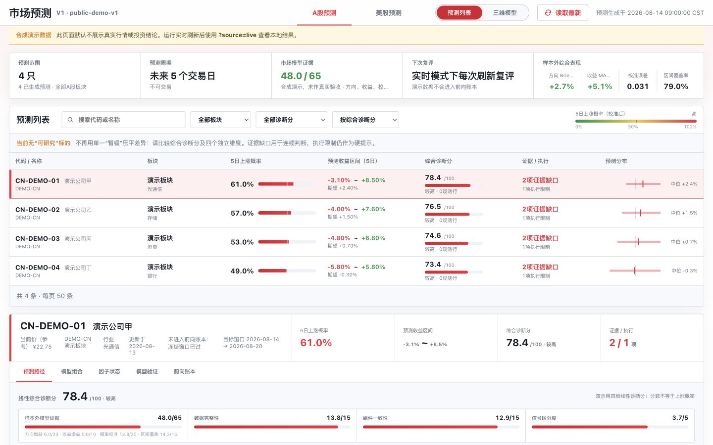

# CN-US Market Lag Radar

一个面向研究的中美市场信号看板。项目把 A 股全市场板块动态发现、跨市场映射、5 个交易日预测、滚动样本外验证、概率校准和前向账本放在同一套可审计流程中。

> 本项目不是荐股软件，不承诺收益，不提供自动交易。默认页面只使用确定性合成数据；真实行情需要由使用者在本地刷新，并自行确认数据许可、时效和完整性。



## 功能

- 每次实时刷新重新扫描 A 股行业与概念，而不是在固定板块池内循环排序。
- A 股和美股分别训练、定权、校准和验证，固定 5 个交易日为生产终点。
- 组合市场先验、正则逻辑回归、梯度提升树和稳健趋势模型。
- 使用 purged walk-forward、独立校准区间、封存测试区间和前向账本减少信息泄漏。
- 同时展示上涨概率、预期收益、预测区间、诊断分、证据缺口和执行限制。
- 证据不足时明确拒绝输出买入型结论。
- 桌面和移动端响应式页面；另有数学模型三维评价视图。

## 立即运行演示

演示不需要安装第三方依赖：

```bash
git clone https://github.com/GuoHaoyu1688/cn-us-market-lag-radar.git
cd cn-us-market-lag-radar
python3 scripts/serve.py
```

打开 `http://127.0.0.1:8012/`。页面顶部的黄色提示代表当前使用合成数据。

公开演示地址：`https://guohaoyu1688.github.io/cn-us-market-lag-radar/`

重新生成演示数据：

```bash
python3 scripts/generate_demo_data.py
```

## 本地实时模式

建议 Python 3.11 或 3.12：

```bash
python3 -m venv .venv
source .venv/bin/activate
python -m pip install --upgrade pip
python -m pip install -r requirements-live.txt
cp .env.example .env
python scripts/refresh_market_lag_dashboard.py
python scripts/serve.py
```

打开 `http://127.0.0.1:8012/?source=live`。首次刷新会下载较多历史日线，耗时取决于网络和数据源状态。

实时刷新只写入被 Git 忽略的 `output/market_lag_dashboard/data/`，不会覆盖仓库中的合成演示数据。

## 测试

```bash
python -m pip install -r requirements.txt
PYTHONPATH=scripts python -m unittest discover -s tests -p 'test_*.py'
python scripts/sanitize_check.py
```

## 模型边界

该项目的“综合诊断分”不是上涨概率，也不是收益承诺。真实模式只有在方向 Brier 增益、收益 MAE 增益、概率校准、区间覆盖、数据质量和执行窗口等条件通过时，才允许进入“可研究”状态。模型仍会受到制度变化、拥挤交易、停牌涨跌停、复权误差、数据源中断、行业映射漂移和幸存者偏差影响。

完整方法见 [模型卡](docs/MODEL_CARD.md) 和 [系统架构](docs/ARCHITECTURE.md)。

## 隐私与安全

开源版本不包含以下内容：

- 券商账号、持仓、成交、净值或登录状态
- X、OpenAI、Tushare 或其他 API 密钥
- 本机用户名、绝对路径、浏览器资料、日志和缓存
- 原项目的历史快照、报告和真实前向账本

提交前请运行 `python scripts/sanitize_check.py`。详细说明见 [隐私设计](docs/PRIVACY.md) 和 [安全政策](SECURITY.md)。

## 数据源

实时模式会尝试访问公开行情或公开 RSS。数据源可能变更、限流或附带单独的使用条款。本仓库不再分发第三方真实行情数据，也不代理付费数据。详情见 [数据源说明](docs/DATA_SOURCES.md)。

## 贡献

Issue 和 Pull Request 均欢迎。算法修改必须附带点时约束说明、样本外验证和失败条件，不能只展示收益最好的回测片段。参见 [CONTRIBUTING.md](CONTRIBUTING.md)。

## 许可证

代码以 [Apache License 2.0](LICENSE) 发布。市场数据、新闻、商标和第三方服务仍受各自权利与条款约束。
